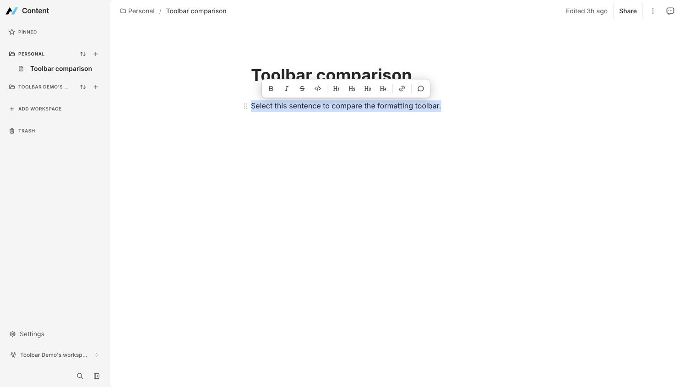
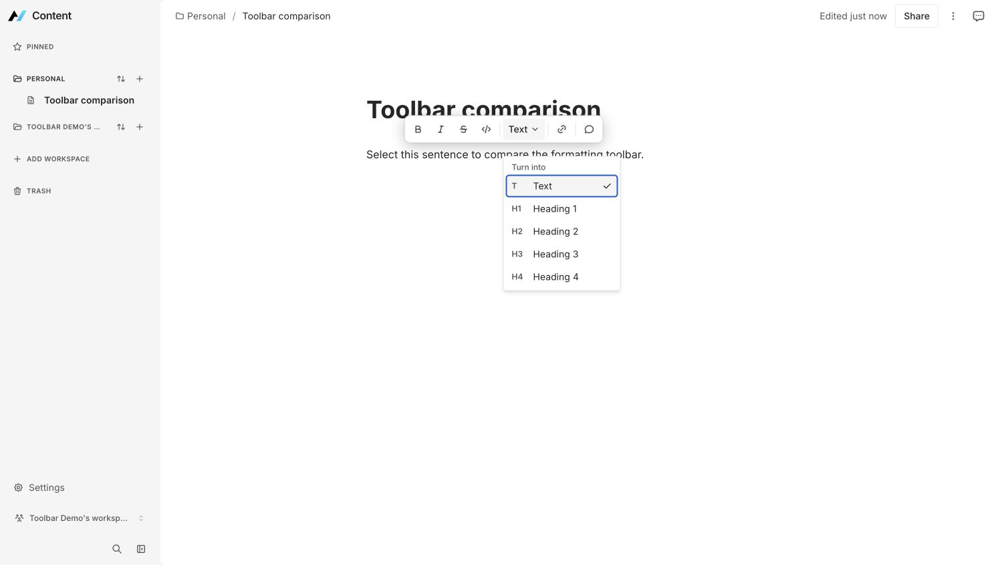

# Content text selector visual evidence

Matched desktop captures for the compact Text/H1-H4 selector in the Content editor.

## Before

- Source revision: `dcc028cb7d67a0f9279f9235cdc4c16710ce5689`
- Route: `http://127.0.0.1:3317/page/j4a5KAEDBHXY`
- Viewport: `1496 x 846`, desktop Chrome
- Fixture account: disposable local account `toolbar-demo@example.com`
- Fixture page: `Toolbar comparison`
- Fixture paragraph: `Select this sentence to compare the formatting toolbar.`
- UI state: Personal workspace expanded, agent panel closed, full paragraph selected, formatting bubble open, text-style submenu closed

## After

- Source: this pull request's production build
- Route: `http://127.0.0.1:3317/page/vDisteHisXMq`
- Viewport: `1496 x 846`, desktop Chrome
- Fixture account, page title, paragraph, sidebar state, and agent-panel state match the before capture
- UI state: full paragraph selected, formatting bubble open, Text selector expanded, Text checked, H1-H4 visible
- The route differs because the isolated worktree uses its own disposable local fixture database; the rendered fixture and viewport are matched

